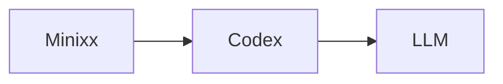
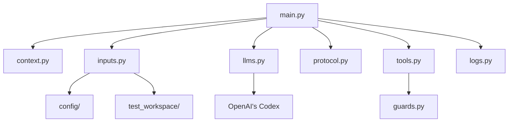

# Minixx

Minixx is a didactic Python project for studying how to build a simple code agent.

## Design Principles

- Minixx is intended for learning, experimentation, and research.
- Minixx favors a simple architecture that is easy to understand and extend.
- Minixx currently uses OpenAI's Codex as its backend, but the design can be extended to support other models, including Small Language Models.

## Run

Minixx runs against a workspace passed on the command line.

Each workspace should contain:

- a `prompt.txt` file
- the files that the agent is allowed to inspect

Example `prompt.txt`:

```text
Rename the function old_name to new_name in all relevant files and return a unified diff patch.
```

Run command:

```bash
python3 main.py ./test_workspace/test-rename-refactoring
```

The selected workspace path becomes the backend working directory for the run.
Tool paths are also restricted to that workspace.


## Demo Workspaces

- `./test_workspace/test-find-secret-key`: file discovery and secret lookup
- `./test_workspace/test-find-symbol`: symbol search and precise location reporting
- `./test_workspace/test-rename-refactoring`: cross-file refactoring and patch generation
- `./test_workspace/test-create-program`: program creation and test generation as a unified diff patch
- `./test_workspace/test-fix-failing-test`: test execution, bug diagnosis, and patch generation

## Model used by the Agent

Minixx currently uses OpenAI's Codex as its default backend in read-only mode.
It can also be configured to use other models through different backends, such as local models served by Ollama.



Requirements:

- the Codex desktop app or CLI must be installed
- the `codex` executable must be available in your shell `PATH`
- the backend configuration lives in `./config/config.json`
- `pytest` must be available in the Python environment used to run Minixx

If `python3 main.py` fails with a message like `Codex CLI not found in PATH`, the most likely issue is that the local `codex` executable is not available in your shell environment.

## Architecture



- `config/config.json` stores backend settings.
- `config/system_prompt.txt` stores the agent's behavior instructions.
- `context.py` stores the execution context for a single agent run.
- `guards.py` validates and resolves tool paths inside the workspace.
- `inputs.py` loads configuration and workspace prompts.
- `llms.py` selects the backend and performs the LLM request.
- `protocol.py` parses and repairs model responses.
- `tools.py` executes agent tools.
- `logs.py` writes traces to `agent.log`.
- `main.py` runs the agent loop.

## Tools

- `list_files`
- `read_file`
- `find_text`
- `run_tests`
- `finish`

Minixx can inspect files, search for text, reason about changes, and propose patches.
It does not apply edits directly.
Tool file and directory paths must stay inside the selected workspace.

The model responds with `Thought`, `Action`, and `Action Input`.

`find_text` expects this input format:

```text
search text | /path/to/directory
```

`run_tests` runs the workspace test suite using a fixed `pytest` command.

When a task requires a code change, the intended behavior is to return a unified diff patch in the final `finish` response.

## Security

Minixx is designed to run against a selected workspace.
Tool paths are validated by `guards.py`, which prevents file and directory access outside that workspace.
The `run_tests` tool uses a fixed test command instead of accepting an arbitrary shell command.
This is a simple safety mechanism for local agent experiments, not a complete sandbox.
