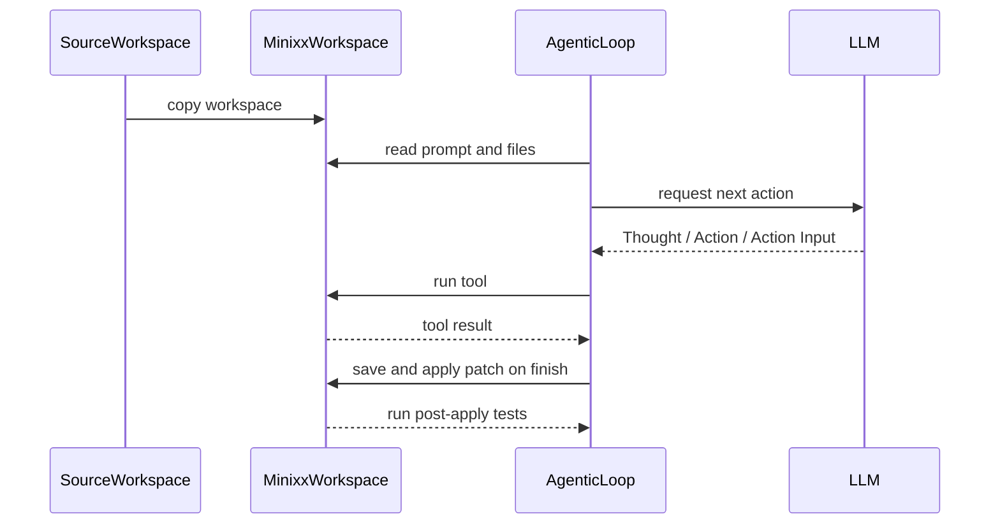
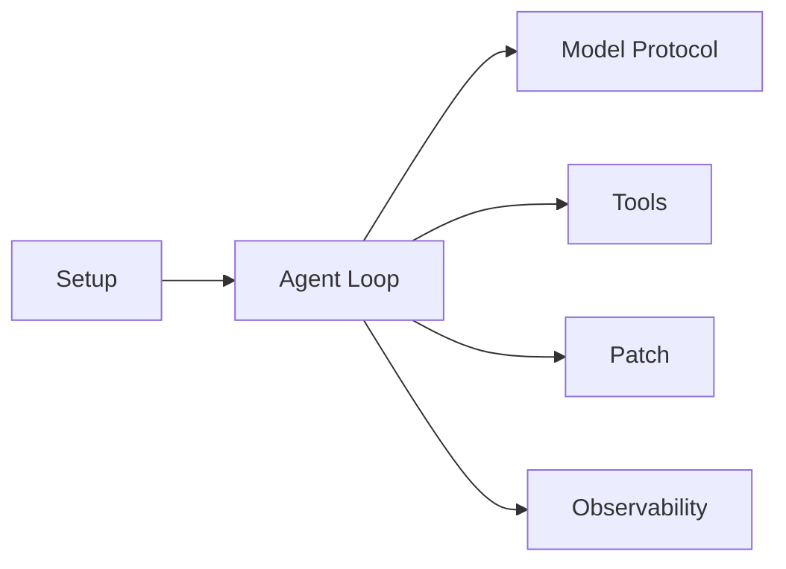

# Minixx

<p align="center">
  
</p>

Minixx is a didactic Python project for studying how to build a small code agent.
It is an ongoing research project developed by [ASERG](https://aserg.labsoft.dcc.ufmg.br/) at DCC/UFMG.

## Overview

Minixx is intentionally small.
It focuses on one narrow workflow:

1. load a workspace
2. copy it to an internal runtime directory
3. let a model inspect files and run tests
4. require the model to finish with a unified diff patch
5. ask the user for approval before applying that patch
6. run tests again after patch application before accepting the run

The project is meant for learning, experimentation, and research rather than broad production automation.

## Design Principles

- Minixx keeps the architecture intentionally small and readable.
- Minixx isolates edits in a copied runtime workspace instead of modifying the original input workspace.
- Minixx uses a single OpenAI-compatible chat API in the documented setup.

## Quick Start

Setup:

```bash
python3 -m venv .venv
source .venv/bin/activate
python -m pip install -r requirements.txt
export OPENAI_API_KEY="your_key_here"
```

Run:

```bash
python run_minixx.py ./test_workspace/bugfix_001_date_range
```

The default configuration calls the OpenAI API directly.
If you want another OpenAI-compatible provider, set `openai_base_url` in `config/config.json`.

What you should expect during a run:

- Minixx prints the selected model and the loaded `prompt.txt`
- it creates or refreshes `./minixx-workspace`
- the model chooses among a small set of tools
- if the model finishes with a patch, Minixx prints the patch and asks for approval before running `git apply`
- after patch application, Minixx runs tests automatically before reporting success
- if post-apply tests fail, Minixx resets `./minixx-workspace` and asks the model for a different patch
- when the run ends, Minixx prints the final status, total token usage, and elapsed time

## Configuration

The default [config/config.json](/Users/mtov/minixx/config/config.json) is:

```json
{
  "model": "openai-compatible",
  "openai_base_url": null,
  "openai_model": "gpt-5.4-mini",
  "timeout_seconds": 600,
  "openai_api_key_env": "OPENAI_API_KEY"
}
```

Notes:

- with `openai_base_url: null`, Minixx calls the default OpenAI API directly
- the documented setup requires `OPENAI_API_KEY`
- `openai_model` selects the concrete model used through the OpenAI-compatible path
- `timeout_seconds` applies to the model request
- `pytest` must be available in the same Python environment used to run Minixx

## Workspace Contract

Minixx runs against a workspace directory passed on the command line.
Each workspace should contain:

- `prompt.txt`
- the project files the agent may inspect or patch
- the tests the agent may run

It may also contain:

- `AGENTS.md`, which is appended to the system prompt as workspace-specific guidance

Example `prompt.txt`:

```text
Fix the date-range bug without changing the intended inclusive behavior.
Run: `python -m pytest -q`.
```

In practice, the current example workspaces also follow this layout:

- `src/` contains the buggy implementation
- `tests/` contains the test suite used by Minixx
- `requirements.txt` documents the local dependency expectation for the workspace
- `metadata.json` stores a small description of the task

## How Tests Work

Each workspace is designed to be executed from its own directory.
That means:

- imports like `from src.foo import bar` assume the current working directory is the workspace root
- Minixx runs tests from inside the copied runtime workspace, not from the repository root
- if you manually validate a workspace, `cd` into that workspace first

Example:

```bash
cd ./test_workspace/bugfix_001_date_range
python -m pytest -q
```

Minixx itself uses a fixed test command based on `python -m pytest -q -p no:cacheprovider` and does not allow arbitrary shell commands for testing.

## Runtime Workspace

For each run, Minixx copies the selected workspace into a fixed internal directory named `minixx-workspace`.
The original workspace is preserved.
All reads, test runs, patch validation, and patch application happen only inside `minixx-workspace`.

This gives Minixx a predictable temporary working area with a stable path across runs.
Before the next run, Minixx deletes the previous `minixx-workspace` and recreates it from the new source workspace.

This has a few important consequences:

- the source workspace is treated as input only
- all tool actions are constrained to `minixx-workspace`
- patch validation and patch application happen only in the copied workspace
- the runtime workspace is disposable and is recreated on the next run

## Example Workspaces

The repository currently ships with five curated workspaces:

- `./test_workspace/bugfix_001_date_range`: a compact date-range bug with an inclusive boundary expectation
- `./test_workspace/bugfix_002_order_totals`: a checkout bug where a percentage coupon is effectively applied twice
- `./test_workspace/feature_001_buy2get50`: a checkout feature that adds a `BUY2GET50` promotion over grouped eligible unit prices
- `./test_workspace/refactor_001_rename`: a checkout refactor that renames `coupon` terminology to `discount_code` across production code and tests
- `./test_workspace/refactor_002_remove_duplication`: an order-rules refactor that extracts duplicated eligibility-selection logic into a helper

These workspaces are designed so that:

- bugfix tasks start from failing behavior and are validated by tests
- feature tasks start from missing behavior and are validated by tests
- refactor tasks start from passing behavior and require coordinated updates to code and tests
- the changes can be expressed as a patch
- the examples stay practical and close to realistic maintenance tasks

## Patch Workflow

When Minixx finishes a task, it expects a unified diff patch.
That patch is saved to `minixx-workspace/patch.txt`.

Before applying the patch, Minixx:

1. validates the patch structure
2. attempts lightweight automatic repair for common diff formatting issues
3. prints the exact command that will run
4. prints the full patch as a command preview
5. asks the user for approval

If the user approves, Minixx runs `git apply patch.txt` inside `minixx-workspace`.

After the patch is applied, Minixx also runs tests automatically.
If the post-apply test run does not pass, the runtime workspace is reset to the original source state and the model must try again with a different patch.
If the model tries to `finish` without returning a unified diff patch, that finish is rejected and the run continues.

The patch helper also normalizes a few common formatting problems before validation, such as:

- fenced code block wrappers around the diff
- patch text that includes extra explanation above the first diff header
- malformed hunk body lines that are missing a unified diff prefix
- stale hunk counts that can be recalculated automatically

Manual validation:

```bash
cd ./minixx-workspace
git apply --check patch.txt
git apply patch.txt
```

## How One Run Works

1. Minixx loads `config/config.json` and `config/system_prompt.txt`.
2. Minixx resolves the source workspace passed on the command line.
3. Minixx recreates `minixx-workspace` as a copy of that source workspace.
4. Minixx loads `prompt.txt` and optional `AGENTS.md` from the copied workspace.
5. `agentic_loop.py` asks the configured model for the next action.
6. `tools.py` executes the selected tool inside `minixx-workspace`.
7. When the model returns `finish`, `finish_handler.py` validates the output and routes patch application through `patches.py`.
8. If a patch is approved and applied, Minixx runs post-apply tests before accepting the run.



## Architecture



The codebase is intentionally small and can be read as six main modules:

- `Setup`
  Files:
  `run_minixx.py`: repository entry script
  `src/minixx/__main__.py`: package entry point
  `src/minixx/__init__.py`: package marker
  `src/minixx/inputs.py`: loads config and prompts, resolves the source workspace, and prepares `minixx-workspace`
  `config/config.json`: model and runtime settings
  `config/system_prompt.txt`: main agent instructions
- `Agent Loop`
  Files:
  `src/minixx/agentic_loop.py`: runs the main ReAct-style loop, handles finish actions, and controls retries
  `src/minixx/context.py`: shared dataclasses for runtime state, history, and finish/loop results
- `Model Protocol`
  Files:
  `src/minixx/models.py`: sends requests to the configured model backend
  `src/minixx/protocol.py`: parses, validates, and repairs model responses into Minixx actions
- `Tools`
  Files:
  `src/minixx/tools.py`: implements the available workspace-safe tools
  `src/minixx/guards.py`: validates safe paths and keeps tool access constrained to the runtime workspace
- `Patch`
  Files:
  `src/minixx/finish_handler.py`: validates `finish` outputs and orchestrates patch apply plus verification
  `src/minixx/patches.py`: saves, repairs, previews, validates, and applies unified diff patches
  `src/minixx/test_failures.py`: summarizes post-apply test failures for retry prompts
- `Observability`
  Files:
  `src/minixx/cli_output.py`: formats iteration lines, final status messages, and elapsed time
  `src/minixx/traces.py`: writes execution traces and related debug artifacts such as `agent_trace.log`

## Tools

Available actions:

- `list_files`
- `read_file`
- `find_text`
- `run_tests`
- `finish`

Behavior notes:

- `read_file` shows the filename directly in the iteration line, such as `[3] read_file checkout.py`
- `find_text` expects `search text | /path/to/directory`
- `find_text` shows the searched string in the iteration line, such as `[4] find_text "coupon"`
- `run_tests` uses a fixed `pytest` command instead of an arbitrary shell command
- `finish` must return a unified diff patch in `Action Input`

The model responds using:

- `Thought`
- `Action`
- `Action Input`

## Tracing

Minixx writes execution traces to `agent_trace.log`.
That file is cleared at the beginning of each new run, so it always represents only the most recent execution.
Each model response also records token usage when the provider exposes it, plus a cumulative total for the run.
The CLI also prints the total elapsed time at the end of the run.
Because the project is didactic, inspecting this trace is often the easiest way to understand how the agent moved through a task.

The trace format is intentionally compact.
It uses short section headers such as:

- `[request]`
- `[response N]`
- `[repair_response N]`
- `[validation_error]`
- `[repair_attempt]`
- `[command]`
- `[finish]`

## Security and Limits

- Minixx never modifies the original input workspace
- file and directory tool paths are restricted to `minixx-workspace`
- `run_tests` uses a fixed command, not arbitrary shell execution
- patch application requires explicit user approval
- the project assumes cooperative local execution and does not try to provide OS-level sandboxing
- this is a lightweight local safety model, not a full sandbox

## Current Scope

Minixx is intentionally narrow.
It does not try to be:

- a general autonomous coding agent
- a multi-provider orchestration framework
- a full secure sandbox
- a benchmark runner for arbitrary repositories

Instead, it is a compact reference implementation for studying:

- agent loops over a small tool API
- patch-based code modification
- approval before mutation
- post-apply validation with tests
- curated workspace tasks in a small, practical setup
