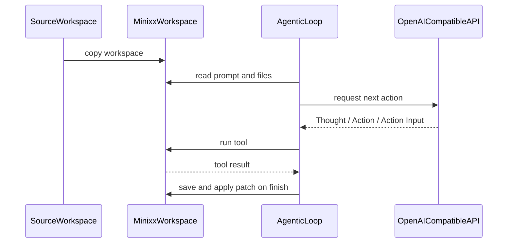

# Minixx

<p align="center">
  
</p>

Minixx is a didactic Python project for studying how to build a small code agent.
It is an ongoing research project developed by [ASERG](https://aserg.labsoft.dcc.ufmg.br/) at DCC/UFMG.

## Design Principles

- Minixx is meant for learning, experimentation, and research.
- Minixx keeps the architecture intentionally small and readable.
- Minixx isolates edits in a copied runtime workspace instead of modifying the original input workspace.
- Minixx uses a single OpenAI-compatible chat API in the documented setup.

## Quick Start

Setup:

```bash
python3 -m venv .venv
source .venv/bin/activate
python -m pip install -r requirements.txt
export OPENAI_API_KEY="your_key_here"
```

Run:

```bash
python run_minixx.py ./test_workspace/bugfix_001_slugify
```

The default configuration calls the OpenAI API directly.
If you want another OpenAI-compatible provider, set `openai_base_url` in `config/config.json`.

## Workspace Contract

Minixx runs against a workspace directory passed on the command line.
Each workspace should contain:

- `prompt.txt`
- the project files the agent may inspect or patch
- any tests the agent may run

It may also contain:

- `AGENTS.md`, which is appended to the system prompt as workspace-specific guidance

Example `prompt.txt`:

```text
Corrija a função `slugify(title)` em `src/text_utils.py`.
Execute: `python -m pytest -q`.
```

## Runtime Workspace

For each run, Minixx copies the selected workspace into a fixed internal directory named `minixx-workspace`.
The original workspace is preserved.
All reads, test runs, patch validation, and patch application happen only inside `minixx-workspace`.

This gives Minixx a predictable temporary working area with a stable path across runs.
Before the next run, Minixx deletes the previous `minixx-workspace` and recreates it from the new source workspace.

## Current Example Workspace

The repository currently ships with one example workspace:

- `./test_workspace/bugfix_001_slugify`: bug fixing with test execution and final patch application

## Model Options

Minixx uses the documented `openai-compatible` model path.

The default `config/config.json` is:

```json
{
  "model": "openai-compatible",
  "openai_base_url": null,
  "openai_model": "gpt-5.4-mini",
  "timeout_seconds": 600,
  "openai_api_key_env": "OPENAI_API_KEY"
}
```

Notes:

- with `openai_base_url: null`, Minixx calls the default OpenAI API directly
- the default setup requires `OPENAI_API_KEY`
- `openai_model` selects the model for the OpenAI-compatible path
- `pytest` must be available in the Python environment used to run Minixx

## Tools

Available actions:

- `list_files`
- `read_file`
- `find_text`
- `run_tests`
- `finish`

Behavior notes:

- `read_file` prints `Reading file: <name>` to the console before returning file contents
- `find_text` expects `search text | /path/to/directory`
- `run_tests` uses a fixed `pytest` command instead of an arbitrary shell command
- for code-change tasks, `finish` must return a unified diff patch in `Action Input`

The model responds using:

- `Thought`
- `Action`
- `Action Input`

## Patch Workflow

When Minixx finishes a code-change task, it expects a unified diff patch.
That patch is saved to `minixx-workspace/patch.txt`.

Before applying the patch, Minixx:

1. validates the patch structure
2. attempts lightweight automatic repair for common diff formatting issues
3. prints the exact command that will run
4. prints the full patch as a command preview
5. asks the user for approval

If the user approves, Minixx runs `git apply patch.txt` inside `minixx-workspace`.

For bug-fixing tasks, Minixx also runs tests automatically after the patch is applied.
If the post-apply test run does not pass, the `finish` step is rejected.

Manual validation:

```bash
cd ./minixx-workspace
git apply --check patch.txt
git apply patch.txt
```

## How One Run Works

1. Minixx loads `config/config.json` and `config/system_prompt.txt`.
2. Minixx resolves the source workspace passed on the command line.
3. Minixx recreates `minixx-workspace` as a copy of that source workspace.
4. Minixx loads `prompt.txt` and optional `AGENTS.md` from the copied workspace.
5. `agentic_loop.py` asks the configured model for the next action.
6. `tools.py` executes the selected tool inside `minixx-workspace`.
7. `finish_handler.py` validates the final response, applies the patch if needed, and runs post-apply checks for bug fixes.



## Architecture

Configuration:

- `config/config.json` stores model settings
- `config/system_prompt.txt` stores the main agent instructions

Core:

- `src/minixx/agentic_loop.py` runs the main ReAct-style loop
- `src/minixx/inputs.py` loads config, prompt files, and prepares `minixx-workspace`
- `src/minixx/models.py` sends requests to the configured model backend
- `src/minixx/protocol.py` parses and repairs model responses
- `src/minixx/tools.py` implements the available workspace-safe tools
- `src/minixx/finish_handler.py` validates, repairs, applies, and verifies final `finish` outputs
- `src/minixx/patches.py` saves, repairs, validates, and applies unified diff patches
- `src/minixx/command_runner.py` previews mutating commands and asks the user for approval
- `src/minixx/traces.py` records the execution trace and token usage

Support:

- `src/minixx/history_manager.py`

Shared types and support:

- `src/minixx/context.py`
- `src/minixx/guards.py`

## Tracing

Minixx writes execution traces to `agent_trace.log`.
Each model response also records token usage when the provider exposes it, plus a cumulative total for the run.
Because the project is didactic, inspecting this trace is often the easiest way to understand how the agent reasoned through a task.

## Security and Limits

- Minixx never modifies the original input workspace
- file and directory tool paths are restricted to `minixx-workspace`
- `run_tests` uses a fixed command, not arbitrary shell execution
- patch application requires explicit user approval
- this is a lightweight local safety model, not a full sandbox
