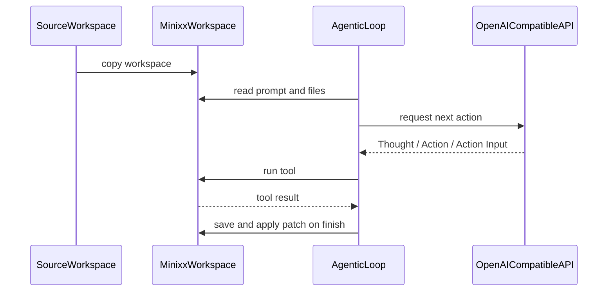

# Minixx

<p align="center">
  
</p>

Minixx is a didactic Python project for studying how to build a small code agent.
It is an ongoing research project developed by [ASERG](https://aserg.labsoft.dcc.ufmg.br/) at DCC/UFMG.

## Overview

Minixx is intentionally small.
It focuses on one narrow workflow:

1. load a bug-fix workspace
2. copy it to an internal runtime directory
3. let a model inspect files and run tests
4. require the model to finish with a unified diff patch
5. ask the user for approval before applying that patch
6. run tests again after patch application for bug-fix tasks

The project is meant for learning, experimentation, and research rather than broad production automation.

## Design Principles

- Minixx is meant for learning, experimentation, and research.
- Minixx keeps the architecture intentionally small and readable.
- Minixx isolates edits in a copied runtime workspace instead of modifying the original input workspace.
- Minixx uses a single OpenAI-compatible chat API in the documented setup.

## Quick Start

Setup:

```bash
python3 -m venv .venv
source .venv/bin/activate
python -m pip install -r requirements.txt
export OPENAI_API_KEY="your_key_here"
```

Run:

```bash
python run_minixx.py ./test_workspace/bugfix_001_slugify
```

The default configuration calls the OpenAI API directly.
If you want another OpenAI-compatible provider, set `openai_base_url` in `config/config.json`.

What you should expect during a run:

- Minixx prints the selected model and the loaded `prompt.txt`
- it creates or refreshes `./minixx-workspace`
- the model chooses among a small set of tools
- if the model finishes with a patch, Minixx prints the patch and asks for approval before running `git apply`
- for bug-fix tasks, Minixx runs tests automatically after patch application

## Configuration

The default [config/config.json](/Users/mtov/minixx/config/config.json) is:

```json
{
  "model": "openai-compatible",
  "openai_base_url": null,
  "openai_model": "gpt-5.4-mini",
  "timeout_seconds": 600,
  "openai_api_key_env": "OPENAI_API_KEY"
}
```

Notes:

- with `openai_base_url: null`, Minixx calls the default OpenAI API directly
- the documented setup requires `OPENAI_API_KEY`
- `openai_model` selects the concrete model used through the OpenAI-compatible path
- `timeout_seconds` applies to the model request
- `pytest` must be available in the same Python environment used to run Minixx

## Workspace Contract

Minixx runs against a workspace directory passed on the command line.
Each workspace should contain:

- `prompt.txt`
- the project files the agent may inspect or patch
- any tests the agent may run

It may also contain:

- `AGENTS.md`, which is appended to the system prompt as workspace-specific guidance

Example `prompt.txt`:

```text
Fix `slugify(title)` in `src/text_utils.py`.
Run: `python -m pytest -q`.
```

In practice, the current bug-fix workspaces also follow this layout:

- `src/` contains the buggy implementation
- `tests/` contains the test suite used by Minixx
- `requirements.txt` documents the local dependency expectation for the workspace
- `metadata.json` stores a small description of the task

## How Tests Work

Each workspace is designed to be executed from its own directory.
That means:

- imports like `from src.foo import bar` assume the current working directory is the workspace root
- Minixx runs tests from inside the copied runtime workspace, not from the repository root
- if you manually validate a workspace, `cd` into that workspace first

Example:

```bash
cd ./test_workspace/bugfix_001_slugify
python -m pytest -q
```

Minixx itself uses a fixed test command based on `python -m pytest -q` and does not allow arbitrary shell commands for testing.

## Runtime Workspace

For each run, Minixx copies the selected workspace into a fixed internal directory named `minixx-workspace`.
The original workspace is preserved.
All reads, test runs, patch validation, and patch application happen only inside `minixx-workspace`.

This gives Minixx a predictable temporary working area with a stable path across runs.
Before the next run, Minixx deletes the previous `minixx-workspace` and recreates it from the new source workspace.

This has a few important consequences:

- the source workspace is treated as input only
- all tool actions are constrained to `minixx-workspace`
- patch validation and patch application happen only in the copied workspace
- the runtime workspace is disposable and is recreated on the next run

## Example Workspaces

The repository currently ships with six bugfix workspaces:

- `./test_workspace/bugfix_001_slugify`: text normalization and fallback slug generation
- `./test_workspace/bugfix_002_date_range`: inclusive date range generation
- `./test_workspace/bugfix_003_inventory`: inventory reservation with rollback on failure
- `./test_workspace/bugfix_004_config_merge`: recursive configuration merge without input mutation
- `./test_workspace/bugfix_005_lru_cache`: least-recently-used eviction and recency tracking
- `./test_workspace/bugfix_006_task_scheduler`: staged dependency scheduling with missing dependency and cycle validation

Suggested difficulty progression:

- simpler:
  - `bugfix_001_slugify`
  - `bugfix_002_date_range`
- intermediate:
  - `bugfix_003_inventory`
  - `bugfix_004_config_merge`
- more stateful or structurally complex:
  - `bugfix_005_lru_cache`
  - `bugfix_006_task_scheduler`

These workspaces are designed so that:

- the tests clearly expose the bug
- the fix can be expressed as a patch
- the post-fix behavior is validated by the same suite
- difficulty increases without requiring a large codebase

## Tools

Available actions:

- `list_files`
- `read_file`
- `find_text`
- `run_tests`
- `finish`

Behavior notes:

- `read_file` prints `Reading file: <name>` to the console before returning file contents
- `find_text` expects `search text | /path/to/directory`
- `run_tests` uses a fixed `pytest` command instead of an arbitrary shell command
- for code-change tasks, `finish` must return a unified diff patch in `Action Input`

The model responds using:

- `Thought`
- `Action`
- `Action Input`

## Patch Workflow

When Minixx finishes a code-change task, it expects a unified diff patch.
That patch is saved to `minixx-workspace/patch.txt`.

Before applying the patch, Minixx:

1. validates the patch structure
2. attempts lightweight automatic repair for common diff formatting issues
3. prints the exact command that will run
4. prints the full patch as a command preview
5. asks the user for approval

If the user approves, Minixx runs `git apply patch.txt` inside `minixx-workspace`.

For bug-fixing tasks, Minixx also runs tests automatically after the patch is applied.
If the post-apply test run does not pass, the `finish` step is rejected.

The patch helper also normalizes a few common formatting problems before validation, such as:

- fenced code block wrappers around the diff
- patch text that includes extra explanation above the first diff header
- malformed hunk body lines that are missing a unified diff prefix
- stale hunk counts that can be recalculated automatically

Manual validation:

```bash
cd ./minixx-workspace
git apply --check patch.txt
git apply patch.txt
```

## How One Run Works

1. Minixx loads `config/config.json` and `config/system_prompt.txt`.
2. Minixx resolves the source workspace passed on the command line.
3. Minixx recreates `minixx-workspace` as a copy of that source workspace.
4. Minixx loads `prompt.txt` and optional `AGENTS.md` from the copied workspace.
5. `agentic_loop.py` asks the configured model for the next action.
6. `tools.py` executes the selected tool inside `minixx-workspace`.
7. when the model returns `finish`, `finish_handler.py` validates the output and routes patch application through `patches.py`.
8. if a patch is approved and applied, Minixx runs post-apply tests for bug-fix tasks before accepting the run.



## Repository Layout

- [run_minixx.py](/Users/mtov/minixx/run_minixx.py): thin entry point
- [config/](/Users/mtov/minixx/config): static configuration and system prompt
- [src/minixx/](/Users/mtov/minixx/src/minixx): the agent implementation
- [test_workspace/](/Users/mtov/minixx/test_workspace): the curated bug-fix tasks
- [minixx-workspace](/Users/mtov/minixx/minixx-workspace): runtime copy created on demand during execution

## Architecture

Configuration:

- `config/config.json` stores model settings
- `config/system_prompt.txt` stores the main agent instructions

Core:

- `src/minixx/agentic_loop.py` runs the main ReAct-style loop
- `src/minixx/inputs.py` loads config, prompt files, and prepares `minixx-workspace`
- `src/minixx/models.py` sends requests to the configured model backend
- `src/minixx/protocol.py` parses and repairs model responses
- `src/minixx/tools.py` implements the available workspace-safe tools
- `src/minixx/finish_handler.py` validates, repairs, applies, and verifies final `finish` outputs
- `src/minixx/patches.py` saves, repairs, validates, previews, and applies unified diff patches
- `src/minixx/traces.py` records the execution trace and token usage

Shared types and support:

- `src/minixx/context.py`
- `src/minixx/guards.py`

Operationally, the key modules are:

- `inputs.py`: turns a source workspace into a runtime workspace and assembles the prompts
- `tools.py`: defines the constrained actions the model can take
- `protocol.py`: validates the model output format
- `patches.py`: validates, previews, and applies patches with user approval
- `finish_handler.py`: enforces that bug-fix tasks only succeed after patch application and passing tests

## Tracing

Minixx writes execution traces to `agent_trace.log`.
Each model response also records token usage when the provider exposes it, plus a cumulative total for the run.
Because the project is didactic, inspecting this trace is often the easiest way to understand how the agent reasoned through a task.

## Security and Limits

- Minixx never modifies the original input workspace
- file and directory tool paths are restricted to `minixx-workspace`
- `run_tests` uses a fixed command, not arbitrary shell execution
- patch application requires explicit user approval
- the project assumes cooperative local execution and does not try to provide OS-level sandboxing
- this is a lightweight local safety model, not a full sandbox

## Current Scope

Minixx is intentionally narrow.
It does not try to be:

- a general autonomous coding agent
- a multi-provider orchestration framework
- a full secure sandbox
- a benchmark runner for arbitrary repositories

Instead, it is a compact reference implementation for studying:

- agent loops over a small tool API
- patch-based code modification
- approval before mutation
- post-apply validation with tests
- curated bug-fix tasks with increasing difficulty
