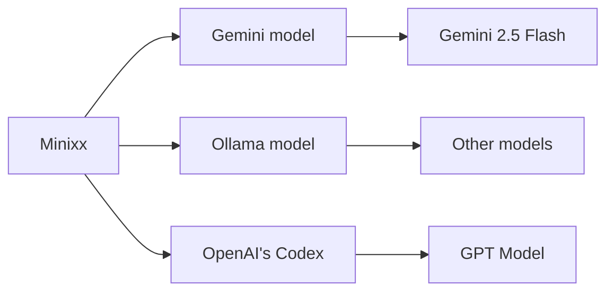
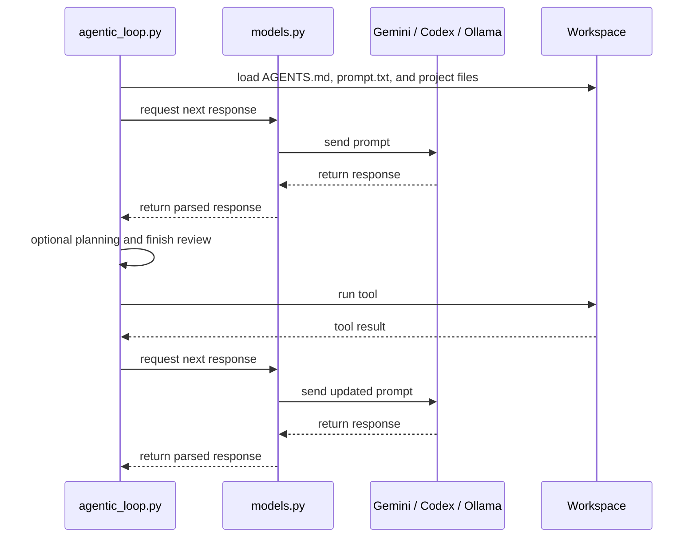
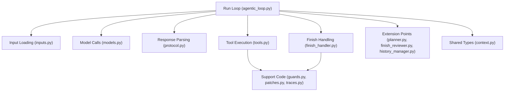
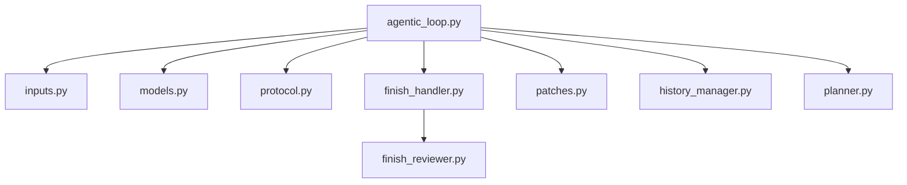

# Minixx

<p align="center">
  
</p>

Minixx is a didactic Python project for studying how to build a simple code agent.
It is an ongoing research project developed by [ASERG](https://aserg.labsoft.dcc.ufmg.br/) at DCC/UFMG.

## Design Principles

- Minixx is intended for learning, experimentation, and research.
- Minixx favors a simple architecture that is easy to understand and extend.
- Minixx currently uses Gemini as its default model, but it can also be configured to use OpenAI's Codex or local models served by Ollama.

## Run

Minixx runs against a workspace passed on the command line.
Run the command from the project root.

Each workspace should contain:

- a `prompt.txt` file
- any project files or tests that the agent is allowed to inspect

It may also contain:

- an `AGENTS.md` file with workspace-specific instructions appended to the system prompt

### Example

`prompt.txt`:

```text
Rename the function old_name to new_name in all relevant files and return a unified diff patch.
```

Setup:

```bash
python3 -m venv .venv
source .venv/bin/activate
python -m pip install -r requirements.txt
export GEMINI_API_KEY="your_key_here"
```

Run command:

```bash
python run_minixx.py ./test_workspace/test-rename-refactoring
```

The selected workspace path becomes the working directory for the run.
Tool paths are also restricted to that workspace.
If a run finishes with a unified diff patch, Minixx also saves that patch to `patch.txt` inside the selected workspace.


## Demo Workspaces

Discovery:
- `./test_workspace/test-find-secret-key`: file discovery and secret lookup
- `./test_workspace/test-find-symbol`: symbol search and precise location reporting

Refactoring:
- `./test_workspace/test-rename-refactoring`: cross-file refactoring and patch generation

Bug Fixing:
- `./test_workspace/test-fix-failing-test`: test execution, bug diagnosis, and patch generation
- `./test_workspace/test-fix-misleading-bug`: cross-file bug fixing with a misleading first suspicion

Program Creation:
- `./test_workspace/test-create-program`: program creation and test generation as a unified diff patch
- `./test_workspace/test-build-stopwatch`: create a small browser-based JavaScript stopwatch app from prompt only

## Model

Minixx currently uses Gemini as its default model.
It can also be configured to use OpenAI's Codex or local models served by Ollama.



Requirements:

- a Gemini model requires a valid `GEMINI_API_KEY` environment variable
- the model configuration lives in `./config/config.json`
- a Codex model requires the Codex desktop app or CLI and the `codex` executable in your shell `PATH`
- an Ollama model requires a reachable Ollama server and a configured model
- `pytest` must be available in the Python environment used to run Minixx

If the run command fails with a message like `Codex CLI not found in PATH`, the most likely issue is that the local `codex` executable is not available in your shell environment when using the Codex model.

## Workspace Instructions

`AGENTS.md` is an optional workspace file for local agent instructions.
Use it for workspace-specific rules such as implementation style, tool usage hints, or constraints that should augment the global system prompt.

Example `AGENTS.md`:

```text
Use only plain HTML, CSS, and JavaScript.
Keep the app small and readable.
Do not add external dependencies.
```

## How One Run Works

1. Minixx loads the model configuration, the global system prompt, and optional workspace instructions from `AGENTS.md`.
2. Minixx loads `prompt.txt` from the selected workspace.
3. `agentic_loop.py` asks `models.py` for the next response.
4. `models.py` calls the configured external model (`Gemini`, `Codex`, or `Ollama`).
5. The loop chooses a tool, receives the tool result, and updates its history.
6. The loop ends when the agent returns a final `finish` output.



## High-Level Architecture



## Core Structure



Configuration:
- `config/config.json` stores model settings.
- `config/system_prompt.txt` stores the agent's behavior instructions.

Core:
- `agentic_loop.py` runs the main ReAct-style loop.
- `inputs.py` loads configuration, prompts, and workspace instructions.
- `models.py` sends requests to the configured external model.
- `protocol.py` parses and repairs model responses.
- `tools.py` executes the available workspace-safe tools.
- `finish_handler.py` validates, repairs, reviews, and persists final `finish` outputs.
- `patches.py` saves generated unified diff patches to `patch.txt`.
- `traces.py` writes execution traces to `agent_trace.log`.

Extension Points:
- `planner.py` defines the optional planning step.
- `finish_reviewer.py` defines the optional final review step before accepting `finish`.
- `history_manager.py` encapsulates history creation, update, and serialization.

Shared Types and Support:
- `context.py` defines the main data structures used across one run.
- `guards.py` validates and resolves tool paths inside the selected workspace.
- `patches.py` persists final patch outputs.
- `traces.py` records the request/response trace for inspection.

## Data Classes

- `ModelConfig` stores the typed model configuration used by one run.
- `AgentContext` stores the configuration and stable inputs for one agent run.
- `AgentResponse` stores one parsed model decision: `thought`, `action`, `action_input`, and `action_description`.
- `AgentHistory` stores the accumulated iteration history used in the ReAct loop.

## Tools

- `list_files`
- `read_file`
- `find_text`
- `run_tests`
- `finish`

Minixx can inspect files, search for text, reason about changes, and propose patches.
It does not apply edits directly.
Tool file and directory paths must stay inside the selected workspace.

The model responds with `Thought`, `Action`, and `Action Input`.
It also returns `Action Description`, a short didactic explanation of the current step and its immediate purpose.

`find_text` expects this input format:

```text
search text | /path/to/directory
```

`run_tests` runs the workspace test suite using a fixed `pytest` command.

When a task requires a code change, the agent is expected to return a unified diff patch in the final `finish` response.
The patch should use real unified diff hunk headers with line ranges, such as `@@ -1 +1 @@` or `@@ -0,0 +1,10 @@`.

## Patch Workflow

When a run finishes with a unified diff patch, Minixx saves the same output to `patch.txt` in the selected workspace.

To validate the saved patch manually, run:

```bash
cd ./test_workspace/test-rename-refactoring
git apply --check patch.txt
```

To apply it manually after that, run:

```bash
git apply patch.txt
```

## Tracing

Minixx writes execution traces to `agent_trace.log`.
Because the project is didactic, users are encouraged to inspect this trace to better understand how the agent reasons, chooses actions, and reacts to tool results.

## Security

Minixx is designed to run against a selected workspace.
Tool paths are validated by `guards.py`, which prevents file and directory access outside that workspace.
The `run_tests` tool uses a fixed test command instead of accepting an arbitrary shell command.
This is a simple safety mechanism for local agent experiments, not a complete sandbox.

## Extension Points

Minixx now includes three small extension points for agent features:

- `planner.py`
- `finish_reviewer.py`
- `history_manager.py`

The first versions are intentionally minimal.
`planner.py` and `finish_reviewer.py` currently return `None`, which means no extra behavior is added yet.
They exist as simple places where new features can be plugged in without changing the overall loop structure.

## What to Inspect First

- Start with `agentic_loop.py` to understand the main loop.
- Then read `context.py` to see the core data structures.
- Then read `planner.py`, `finish_reviewer.py`, and `history_manager.py` to see the new extension points.
- Then read `finish_handler.py` to see how final `finish` responses are handled.
- Then read `models.py` to see how requests are made for each configured integration.
- Then read `patches.py` to see how final patches are persisted.
- Then read `tools.py` to understand what actions the agent can perform.

## Current Limitations

- Minixx runs in read-only patch mode and does not apply edits directly.
- The toolset is intentionally small.
- Output validation is simple and protocol-driven.
- File access is restricted to the selected workspace.
