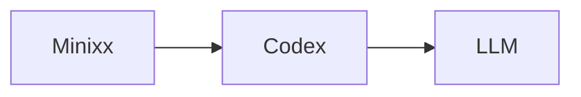

# Minixx

Minixx is a didactic Python project for studying how to build a simple code agent.

## Run

```bash
python3 main.py ./test_workspace/test-find-secret-key
```

## Backend

Minixx currently uses Codex as its backend in read-only mode.



Requirements:

- the Codex desktop app or CLI must be installed
- the `codex` executable must be available in your shell `PATH`
- the backend configuration lives in `./config/config.json`

If `python3 main.py` fails with a message like `Codex CLI not found in PATH`, the most likely issue is that the local `codex` executable is not available in your shell environment.

## Structure

- `config/config.json` stores backend settings.
- `config/system_prompt.txt` stores the agent's behavior instructions.
- `inputs.py` loads configuration and workspace prompts.
- `llms.py` selects the backend and performs the LLM request.
- `protocol.py` parses and repairs model responses.
- `tools.py` executes agent tools.
- `logs.py` writes traces to `agent.log`.
- `main.py` runs the agent loop.

## Tools

- `list_files`
- `read_file`
- `find_text`
- `finish`

The model responds with `Thought`, `Action`, and `Action Input`.

`find_text` expects this input format:

```text
search text | /path/to/directory
```

## Read-Only Patch Mode

Minixx can inspect files, search for text, reason about changes, and propose patches.
It does not apply edits directly.
When a task requires a code change, the intended behavior is to return a unified diff patch in the final `finish` response.

## Workspaces

Each workspace contains its own `prompt.txt` and test files.

Examples:

```text
./test_workspace/test-find-secret-key
./test_workspace/test-find-symbol
./test_workspace/test-rename-refactoring
```

The workspace path is passed on the command line and becomes the backend working directory for the run.

Purposes:

- `test-find-secret-key`: file discovery and secret lookup
- `test-find-symbol`: symbol search and precise location reporting
- `test-rename-refactoring`: cross-file refactoring and patch generation
