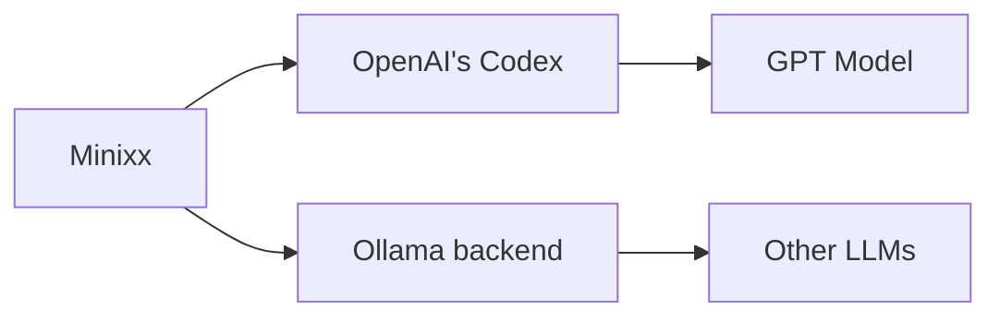
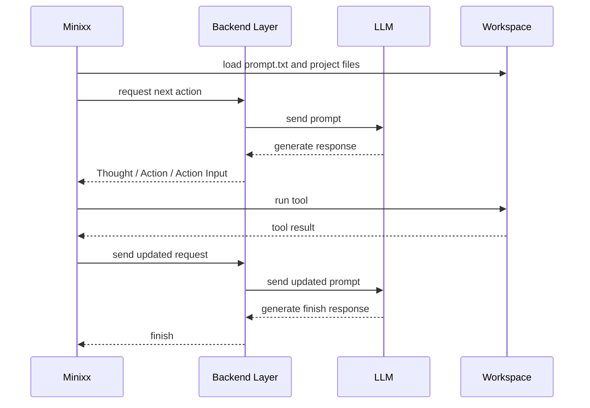
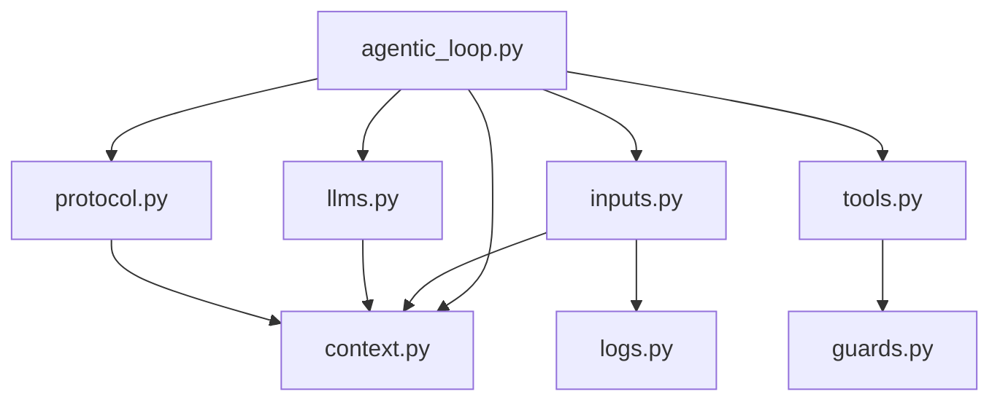

# Minixx


Minixx is a didactic Python project for studying how to build a simple code agent.
It is an ongoing research project developed by [ASERG](https://aserg.labsoft.dcc.ufmg.br/) at DCC/UFMG.

## Design Principles

- Minixx is intended for learning, experimentation, and research.
- Minixx favors a simple architecture that is easy to understand and extend.
- Minixx currently uses OpenAI's Codex as its backend, but the design can be extended to support other models, including Small Language Models.

## Run

Minixx runs against a workspace passed on the command line.
Run the command from the project root.

Each workspace should contain:

- a `prompt.txt` file
- the project files and tests that the agent is allowed to inspect

### Example

`prompt.txt`:

```text
Rename the function old_name to new_name in all relevant files and return a unified diff patch.
```

Run command:

```bash
PYTHONPATH=src python3 -m minixx ./test_workspace/test-rename-refactoring
```

The selected workspace path becomes the backend working directory for the run.
Tool paths are also restricted to that workspace.


## Demo Workspaces

- `./test_workspace/test-find-secret-key`: file discovery and secret lookup
- `./test_workspace/test-find-symbol`: symbol search and precise location reporting
- `./test_workspace/test-rename-refactoring`: cross-file refactoring and patch generation
- `./test_workspace/test-create-program`: program creation and test generation as a unified diff patch
- `./test_workspace/test-fix-failing-test`: test execution, bug diagnosis, and patch generation

## Backend and Model

Minixx currently uses OpenAI's Codex as its default backend layer in read-only mode, acting as a bridge to the underlying model.
It can also be configured to use other backend integrations, such as local models served by Ollama.



Requirements:

- the Codex desktop app or CLI must be installed
- the `codex` executable must be available in your shell `PATH`
- the backend configuration lives in `./config/config.json`
- `pytest` must be available in the Python environment used to run Minixx

If the run command fails with a message like `Codex CLI not found in PATH`, the most likely issue is that the local `codex` executable is not available in your shell environment.

## How One Run Works

1. Minixx loads the backend configuration and the system prompt.
2. Minixx loads `prompt.txt` from the selected workspace.
3. Minixx sends the request to the configured backend.
4. The agent chooses a tool, receives the tool result, and updates its history.
5. The loop ends when the agent returns a final `finish` output.



## Architecture



- `config/config.json` stores backend settings.
- `config/system_prompt.txt` stores the agent's behavior instructions.
- `context.py` defines `AgentContext` and `AgentResponse`.
- `guards.py` validates and resolves tool paths inside the workspace.
- `inputs.py` parses arguments and prepares the run context.
- `llms.py` selects the backend and performs the LLM request.
- `protocol.py` parses and repairs model responses.
- `tools.py` executes agent tools.
- `logs.py` writes traces to `agent.log`.
- `agentic_loop.py` runs the agent loop.

## Data Classes

- `LLMConfig` stores the typed backend configuration used by one run.
- `AgentContext` stores the configuration and stable inputs for one agent run.
- `AgentResponse` stores one parsed model decision: `thought`, `action`, and `action_input`.
- `AgentHistory` stores the accumulated iteration history used in the ReAct loop.

## Tools

- `list_files`
- `read_file`
- `find_text`
- `run_tests`
- `finish`

Minixx can inspect files, search for text, reason about changes, and propose patches.
It does not apply edits directly.
Tool file and directory paths must stay inside the selected workspace.

The model responds with `Thought`, `Action`, and `Action Input`.

`find_text` expects this input format:

```text
search text | /path/to/directory
```

`run_tests` runs the workspace test suite using a fixed `pytest` command.

When a task requires a code change, the agent is expected to return a unified diff patch in the final `finish` response.

## Logging

Minixx writes execution traces to `agent.log`.
Because the project is didactic, users are encouraged to inspect this log to better understand how the agent reasons, chooses actions, and reacts to tool results.

## Security

Minixx is designed to run against a selected workspace.
Tool paths are validated by `guards.py`, which prevents file and directory access outside that workspace.
The `run_tests` tool uses a fixed test command instead of accepting an arbitrary shell command.
This is a simple safety mechanism for local agent experiments, not a complete sandbox.

## What to Inspect First

- Start with `agentic_loop.py` to understand the main loop.
- Then read `context.py` to see the core data structures.
- Then read `llms.py` to see how the backend request is made.
- Then read `tools.py` to understand what actions the agent can perform.

## Current Limitations

- Minixx runs in read-only patch mode and does not apply edits directly.
- The toolset is intentionally small.
- Output validation is simple and protocol-driven.
- File access is restricted to the selected workspace.
